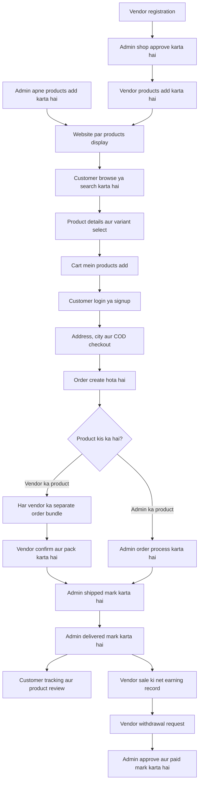
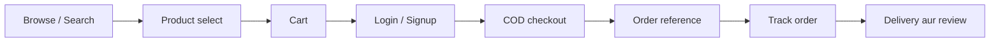
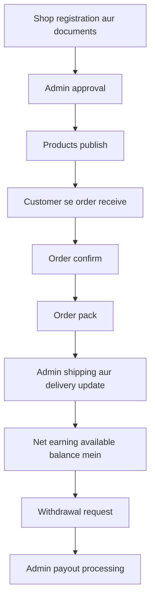
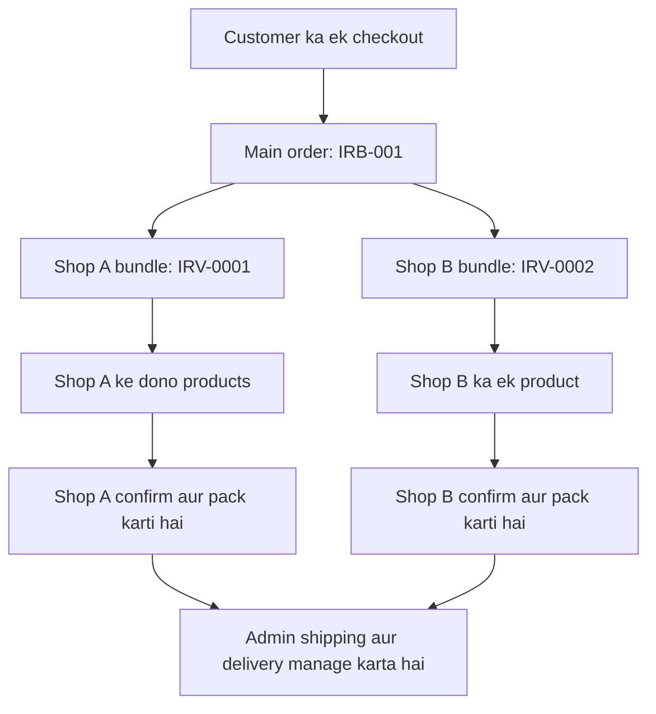
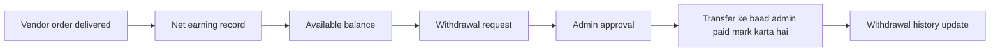
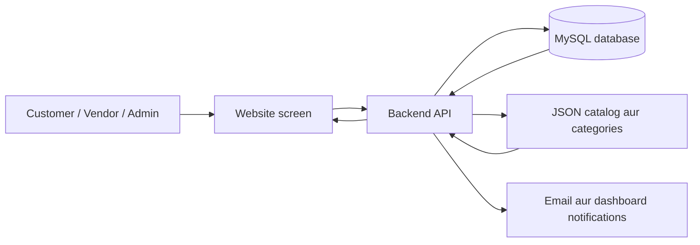

# In Range By Abdullah — Website Functionality aur Workflow

## 1. Website ka main concept

Yeh ek multi-vendor shopping website hai. Customer products khareedta hai, vendor apne products sell karta hai aur admin poori marketplace manage karta hai. Vendor ki sale par platform commission calculate hota hai.

| Role | Main responsibility |
| --- | --- |
| Customer | Shopping, order placement, tracking aur reviews |
| Vendor | Apni shop, products, packing aur earnings manage karna |
| Admin | Catalog, vendor approvals, order shipping/delivery aur payouts manage karna |

## 2. Complete website flowchart

## 3. Customer kya kya kar sakta hai?

### Products explore karna

Customer home page par best sellers, new arrivals, featured products aur categories dekh sakta hai. Search aur category filters ke through apni pasand ka product dhoond sakta hai.

Product detail page par images, description, price, original price/discount, stock, variants aur reviews nazar aate hain. Customer variant aur quantity select karke product cart mein add karta hai.

### Account aur cart

Customer email/password se signup aur login kar sakta hai. Google login configuration ke saath Google sign-in bhi available hota hai. Profile mein name aur phone update karne ka flow hai.

Cart mein products ki quantity change aur items remove kiye ja sakte hain. Cart browser mein save hota hai aur page reload par restore hota hai.

### Checkout aur order

Customer login karke apna name, phone, email, address aur city enter karta hai. Current checkout Cash on Delivery use karta hai. System city ki COD availability, product price, quantity, stock aur variant check karke order save karta hai.

Order ke saath reference number milta hai. Customer track-order page par order ki progress dekh sakta hai aur delivered purchase par product review submit kar sakta hai.

Website mein WhatsApp contact, FAQ, return-policy aur terms-and-conditions pages bhi hain.

## 4. Vendor ka workflow

Vendor registration mein shop aur owner details, contact information, business details, CNIC documents aur bank information submit karta hai. Admin registration review karke shop approve karta hai. Email verification ka flow configuration ke mutabiq use hota hai.

Approved vendor dashboard se products add, edit aur delete kar sakta hai. Har product ke name, description, price, original price, category, stock, images aur active/inactive status manage hote hain. Published vendor products customer catalog mein show hote hain.

Customer order kare to relevant vendor ko apni shop ka order bundle milta hai. Vendor uski details dekh kar order confirm aur pack karta hai. Shipping aur delivery status admin update karta hai.

Vendor dashboard mein My Products, My Orders, My Earnings, Withdrawals, Notifications, Account Status aur Settings ke sections hain. Vendor apni bank/profile details manage aur account suspension ke case mein appeal submit kar sakta hai.

## 5. Admin kya manage karta hai?

| Functionality | Admin ka action |
| --- | --- |
| Dashboard | Orders aur business activity ka overview |
| Products | Main catalog products add, edit, delete aur best sellers select |
| New arrivals | New-arrival catalog items manage |
| Categories | Category names, images aur home-page visibility manage |
| Store settings | Shop/contact details aur COD settings manage |
| Vendor management | Vendor registration approve/reject aur account status manage |
| Orders | Customer orders aur seller bundles ki details dekhna |
| Fulfillment | Shipping, tracking number, delivery aur cancellation manage |
| Commission | Category aur vendor-specific commission rates set |
| Payouts | Vendor withdrawals approve, reject aur paid mark |
| Reviews | Customer reviews approve ya remove |
| Notifications / Appeals | Activity aur vendor appeals review |
| Vendor performance | Risk indicators aur compliance flags dekhna |

## 6. Order vendors mein kaise divide hota hai?

Customer ka ek checkout ek main order banata hai. Agar cart mein vendor products hon, system har vendor ke products ko separate bundle mein group karta hai.

**Example:** Customer Shop A se do products aur Shop B se ek product khareedta hai:

Is tarah customer ek checkout karta hai, jabke har vendor apne products wala order manage karta hai. Order numbers yahan samjhane ke liye example hain.

## 7. Vendor order ki status journey

| Status | Matlab | Kaun update karta hai? |
| --- | --- | --- |
| Pending | Naya order receive hua | System |
| Confirmed | Seller ne order accept kiya | Vendor |
| Packed | Seller ne order pack kar diya | Vendor |
| Shipped | Order dispatch status mein hai | Admin |
| Delivered | Order delivery complete mark hui | Admin |
| Cancelled | Order reason ke saath cancel hua | Authorized vendor/admin flow |

Normal journey: **Pending → Confirmed → Packed → Shipped → Delivered**.

Shipping/delivery ke saath customer email notification functions aur vendor notification functions connected hain. Dashboard badges relevant new activity dikhate hain.

## 8. Commission aur earning ka workflow

System sale amount par commission calculate karta hai. Pehle vendor-specific rate check hota hai, phir category rate, phir Other/Global settings aur aakhir mein default rate use hota hai.

**Example:** Rs. 2,000 ki sale par 10% commission ho:

| Calculation | Amount |
| --- | --- |
| Product sale | Rs. 2,000 |
| Platform commission | Rs. 200 |
| Vendor net earning | Rs. 1,800 |

Vendor bundle delivered mark hone par net earning record hoti hai. Vendor earnings screen par total earnings, available balance aur withdrawn amount dekh sakta hai.

Minimum withdrawal Rs. 500 hai. Request ke waqt system available balance, bank details aur existing open request check karta hai. Payout screen mein admin payment ka status record karta hai.

## 9. Website ke peeche data ka flow

Website Next.js, React aur TypeScript par bani hai. Tailwind styling handle karta hai. Backend APIs database se data read/write karti hain aur Prisma MySQL ke saath communicate karta hai.

Customers, main products, orders, vendors, commissions, earnings aur sessions MySQL mein record hote hain. Separate new-arrival catalog aur categories JSON files mein hain. Images ke liye local uploads, database image storage aur Cloudinary helper paths maujood hain. Cart browser storage mein rehta hai.

## 10. Ek practical shopping example

1. Vendor apni shop register karta hai aur admin approval ke baad product publish karta hai.
2. Customer website par product search karke cart mein add karta hai.
3. Customer login karke delivery details ke saath COD order place karta hai.
4. System order save karta hai, seller ka bundle banata hai aur commission calculate karta hai.
5. Seller order confirm aur pack karta hai.
6. Admin shipped status aur tracking update karta hai, phir delivered mark karta hai.
7. Customer order track karta hai aur delivered product ka review deta hai.
8. Vendor ki net earning record hoti hai aur vendor withdrawal request karta hai.
9. Admin request approve karke payment processing ke baad paid status update karta hai.
